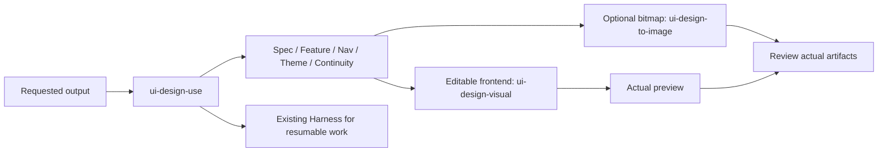

# UI Design

## Plugin marketplaces

This plugin belongs to **Full-stack development**.

| Category | Marketplace | Purpose |
| --- | --- | --- |
| Full-stack development | [Full Stack Plugins](https://github.com/partme-ai/full-stack-plugins) | Architecture and UI design, code understanding, quality checks, code review, workflow governance, and server operations |
| AIGC content creation | [Full AIGC Plugins](https://github.com/partme-ai/full-aigc-plugins) | Image, video, audio, music, 3D, and multimodal content creation |

Model-native frontend design: specifications, feature/navigation contracts, continuity, editable prototypes, optional image assets, preview and review. English display name: **UI Design**. Package `ui-design` 0.1.2 source repository: [ui-design-plugin](https://github.com/full-stack-plugins/ui-design-plugin). Release v0.1.2 is published through Full Stack Plugins; installed-client acceptance is separate; this is a community-maintained integration.

English | [简体中文](README.zh-CN.md) · [Design](docs/ui-design-plugin-design.md) · [Acceptance contract](docs/implementation-spec.md)

## Invoking UI Design

The plugin ID is `ui-design`; its callable entry skill is **`ui-design-use`**. When asked to use the UI Design plugin, resolve and invoke `ui-design-use` from the host skill inventory. Passing `ui-design` to a Skill tool causes `Skill not found: ui-design`. If the host requires a namespace, use the exact qualified name exposed by its inventory.

Example: invoke `ui-design-use` to produce the login-to-feature paths, menu tree and visibility rules, shell layout, components and design system, actions and interactions for all 31 pages, and the P02 role-management sample for ddd4j-ui-pro; write to the project-requested `docs/functional-design/` directory.

## Architecture and skills



The package distributes **11 skills**, all maintained in [design-skills](https://github.com/full-stack-skills/design-skills/tree/v1.15.3). Source v1.15.3 resolves to 5183e6b6ee92bc8f0f6bdbe594bd63d6c550d9a5; skills.lock.json records each complete skill digest. No plugin-local skills are maintained.

Ordinary design requires no MCP or external design platform. Native imagegen is used when available and requested. baoyu-image-gen remains an explicitly selected optional installed backend; its implementation and the Codex system skill are not redistributed. Loading the plugin does not generate images, set credentials, install dependencies or run hooks.

## Use and configuration

Root plugin.json is Agent Plugins 1.0.0. Skills are discovered under skills/. There is no mcp.json because this plugin does not provide an MCP service. Codex/Claude/ZCode/Kimi compatibility manifests are included; actual installed-client loading is separately verified. Source and release are available on GitHub; installed caches are never modified by this repository.

Load from a trusted local package using the client's documented plugin loader, then invoke ui-design-use or a named specialist. Example: “Design an editable responsive account page using this project's existing theme.” A static concept image is not editable UI or runtime proof.

Default logical viewports: Mobile 390×884, Tablet 768×1024, Desktop 1280×1024. Produce requested devices; image tools use their actual raster sizes and disclose approximation. An existing approved baseline is reused for continuation/correction. Product decisions, visual inspection, user approval and production verification remain distinct.

For resumable work, resolve the actual plugin directory and target project's absolute store:

```text
python <plugin-root>/scripts/design_harness_entry.py status --store <absolute-project>/.design-harness --run-id <actual-run-id>
```

The entry refuses relative stores and stores inside the plugin. The bundled Harness defines supported commands/profiles, dispatch and evidence; no second ledger is created.

## Verify and package

Python 3.11+ is sufficient for structural checks and Harness tests:

```bash
python scripts/validate_portable_plugin.py
python scripts/validate_markdown_links.py
python scripts/check_snapshot.py
python -m unittest discover -s tests -v
python -m unittest discover -s skills/ui-design-harness/tests
python scripts/package_plugin.py
```

The archive and SHA256 are written to dist/. Package verification excludes secrets, local caches and executables. The source lock verifies all declared vendored files without downloading or rewriting them.

For the bundled preview example, `node scripts/verify_preview.cjs` requires an already available Playwright module, a browser and Python. Optional environment settings: PLAYWRIGHT_MODULE_PATH (module directory), BROWSER_EXECUTABLE_PATH (actual executable), PYTHON_EXECUTABLE (actual Python executable, especially when Windows only provides a shell alias), PREVIEW_EVIDENCE_DIR (output). No dependencies are installed automatically. It checks synchronization, independent mode, tab semantics, private-input non-replay, logical viewport sizes and screenshots; it validates the bundled demonstration, not a future user project.

## Evidence and limits

See [verification](docs/verification.md) for actual results. Static format checks do not prove a host installation, visual model performance or deployed frontend. Real image generation is request-driven and was not invoked merely for packaging. Optional visual export tooling needs its own installed dependencies. No API secrets are stored in the package.

Update source skills first and refresh their explicit snapshot hashes. Source releases, plugin Releases and marketplace pins identify the published distribution; actual installed-client acceptance remains separate. License: [Apache-2.0](LICENSE); [source notices](THIRD-PARTY-NOTICES.md).

## Installation and skill ownership

Add `partme-ai/full-stack-plugins` using your client marketplace interface, then select **UI Design**. The install source is pinned to `v0.1.2`. Ordinary design needs no MCP connection.

Skills are maintained only in `design-skills`. After publishing a source version, update the pinned release and run:

```bash
python scripts/vendor/skill_vendor.py update
python scripts/vendor/skill_vendor.py check
python scripts/check_snapshot.py
```
