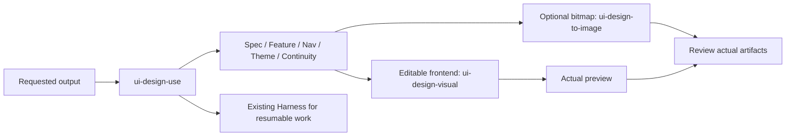

# UI Design

Model-native frontend design: specifications, feature/navigation contracts, continuity, editable prototypes, optional image assets, preview and review. English display name: **UI Design**. Package `ui-design` 0.1.0 source repository: [ui-design-plugin](https://github.com/full-stack-plugins/ui-design-plugin). A tagged release and installed-client acceptance are separate; this is a community-maintained integration.

English | [简体中文](README.zh-CN.md) · [Design](docs/ui-design-plugin-design.md) · [Acceptance contract](docs/implementation-spec.md)

## Architecture and skills



The package includes the nine requested design skills, ui-design-to-image and the local ui-design-use entry, **11 skills** total. Full resources and the existing Python Harness are bundled; source files and hashes are recorded in skills.lock.json. The source is pinned to verified upstream commit dc963c182b7f82d2ee7abe63d0fa6cb29aeef138, including the specification updates and image skill. No release tag is claimed; missing standalone license files are copied from the source root license.

Ordinary design requires no MCP or external design platform. Native imagegen is used when available and requested. baoyu-image-gen remains an explicitly selected optional installed backend; its implementation and the Codex system skill are not redistributed. Loading the plugin does not generate images, set credentials, install dependencies or run hooks.

## Use and configuration

Root plugin.json is Agent Plugins 1.0.0. Skills are discovered under skills/. There is no mcp.json because this plugin does not provide an MCP service. Codex/Claude compatibility manifests are included; actual installed-client loading is separately verified. This source has not been pushed or installed into a client cache.

Load from a trusted local package using the client's documented plugin loader, then invoke ui-design-use or a named specialist. Example: “Design an editable responsive account page using this project's existing theme.” A static concept image is not editable UI or runtime proof.

Default logical viewports: Mobile 390×884, Tablet 768×1024, Desktop 1280×1024. Produce requested devices; image tools use their actual raster sizes and disclose approximation. An existing approved baseline is reused for continuation/correction. Product decisions, visual inspection, user approval and production verification remain distinct.

For resumable work, resolve the actual plugin directory and target project's absolute store:

```text
python <plugin-root>/scripts/design_harness_entry.py status --store <absolute-project>/.design-harness --run-id <actual-run-id>
```

The entry refuses relative stores and stores inside the plugin. The bundled Harness defines supported commands/profiles, dispatch and evidence; no second ledger is created.

## Verify and package

Python 3.11+ is sufficient for structural checks and Harness tests:

```bash
python scripts/validate_portable_plugin.py
python scripts/validate_markdown_links.py
python scripts/check_snapshot.py
python -m unittest discover -s tests -v
python -m unittest discover -s skills/ui-design-harness/tests
python scripts/package_plugin.py
```

The archive and SHA256 are written to dist/. Package verification excludes secrets, local caches and executables. The source lock verifies all declared vendored files without downloading or rewriting them.

For the bundled preview example, `node scripts/verify_preview.cjs` requires an already available Playwright module, a browser and Python. Optional environment settings: PLAYWRIGHT_MODULE_PATH (module directory), BROWSER_EXECUTABLE_PATH (actual executable), PYTHON_EXECUTABLE (actual Python executable, especially when Windows only provides a shell alias), PREVIEW_EVIDENCE_DIR (output). No dependencies are installed automatically. It checks synchronization, independent mode, tab semantics, private-input non-replay, logical viewport sizes and screenshots; it validates the bundled demonstration, not a future user project.

## Evidence and limits

See [verification](docs/verification.md) for actual results. Static format checks do not prove a host installation, visual model performance or deployed frontend. Real image generation is request-driven and was not invoked merely for packaging. Optional visual export tooling needs its own installed dependencies. No API secrets are stored in the package.

Update source skills first and refresh their explicit snapshot hashes. An immutable source version, hosted plugin release, marketplace addition and user-installed-client test remain separate release work. License: [Apache-2.0](LICENSE); [source notices](THIRD-PARTY-NOTICES.md).
