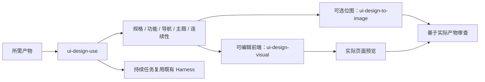

# UI Design

## 插件市场导航

本插件所属分类：**全栈开发**。

| 分类 | 插件市场入口 | 用途 |
| --- | --- | --- |
| 全栈开发 | [Full Stack Plugins](https://github.com/partme-ai/full-stack-plugins) | 架构与 UI 设计、代码理解、质量检查、代码审查、流程治理与服务器运维 |
| AIGC 内容创作 | [Full AIGC Plugins](https://github.com/partme-ai/full-aigc-plugins) | 图像、视频、音频、音乐、3D 与多模态内容创作 |

基于宿主大模型的前端设计插件，覆盖规格、功能与导航合同、界面连续性、可编辑原型、可选生图、预览和审查。英文显示名称统一为 **UI Design**。`ui-design` 0.1.1 源码仓库：[ui-design-plugin](https://github.com/full-stack-plugins/ui-design-plugin)。固定版本 v0.1.1 通过 Full Stack 插件市场分发，客户端安装验收另行进行，本插件由社区维护。

[English](README.md) | 简体中文 · [设计方案](docs/ui-design-plugin-design.md) · [验收合同](docs/implementation-spec.md)

## 架构与技能



分发 **11 个技能**，包括入口 ui-design-use，全部在 [design-skills](https://github.com/full-stack-skills/design-skills/tree/v1.15.1) 维护。来源 v1.15.1 固定于 13d8e347002d4be3bb6a5b6415df64fc0a4d52db，完整技能摘要记录在 skills.lock.json；插件不维护技能例外。

普通设计不需要 MCP 或外部设计平台。需要图片且原生 imagegen 可用时，默认使用宿主能力；baoyu-image-gen 是用户明确选择后才使用的可选已安装后端，不分发其实现或 Codex 系统技能。插件加载不会生成图片、设置凭据、安装依赖或运行提示 hooks。

## 使用与配置

根 plugin.json 遵守 Agent Plugins 1.0.0，skills/ 为固定技能发现目录。本插件不提供 MCP 服务，因此无需 mcp.json。包含 Codex/Claude/ZCode/Kimi 兼容清单，具体客户端安装加载须单独验证；源码与固定版本托管于 GitHub，不修改已安装缓存。

通过客户端支持的本地加载流程使用可信插件包，然后调用 ui-design-use 或指定专业技能。例如：“根据当前项目已有主题设计一个可编辑的响应式账户页面。”静态效果图不能证明可编辑控件或实际运行。

默认逻辑视口为 Mobile 390×884、Tablet 768×1024、Desktop 1280×1024；按用户要求交付设备，图像模型使用其实际支持的像素尺寸并说明近似。继续下一页或局部修改继承真实已批准基线；产品决策、视觉检查、用户批准与生产运行验证分别记录。

持续任务使用实际插件目录和目标项目的绝对 store：

```text
python <plugin-root>/scripts/design_harness_entry.py status --store <absolute-project>/.design-harness --run-id <actual-run-id>
```

入口拒绝相对 store 或插件内部 store。命令、profile、dispatch 和证据由既有 Harness 定义，不建立另一套任务账本。

## 验证与打包

Python 3.11+ 可运行结构检查和 Harness 测试：

```bash
python scripts/validate_portable_plugin.py
python scripts/validate_markdown_links.py
python scripts/check_snapshot.py
python -m unittest discover -s tests -v
python -m unittest discover -s skills/ui-design-harness/tests
python scripts/package_plugin.py
```

压缩包与 SHA256 输出到 dist/，排除私有凭据、缓存和本地可执行文件。快照检查不下载或改写源文件。

已有 Playwright、浏览器和 Python 时，可运行 `node scripts/verify_preview.cjs` 检查内置预览示例。可选环境设置：PLAYWRIGHT_MODULE_PATH 指向模块目录，BROWSER_EXECUTABLE_PATH 指向浏览器，PYTHON_EXECUTABLE 指向真实 Python 可执行文件（Windows 仅有命令别名时尤其需要），PREVIEW_EVIDENCE_DIR 指定输出。不会静默安装依赖。覆盖同步、独立模式、选项卡语义、私有输入不回放、真实逻辑尺寸和截图，仅证明内置示例，不代替未来用户项目验收。

## 证据与限制

实际结果见[验证记录](docs/verification.md)。结构通过不证明客户端安装、生图模型质量或已部署前端。本轮未为打包调用真实生图；可选视觉导出工具需要各自已有依赖。包内不保存 API 密钥。

先修改技能源，再明确刷新快照哈希。技能源 Release、插件 Release 与市场固定版本共同标识分发内容；用户客户端安装验收仍单独记录。许可证为 [Apache-2.0](LICENSE)，见[来源说明](THIRD-PARTY-NOTICES.md)。

## 安装与技能源维护

通过客户端市场界面添加 `partme-ai/full-stack-plugins`，再选择 **UI Design**；安装来源固定为 `v0.1.1`。普通设计无需 MCP 连接。

技能内容只在 `design-skills` 修改。先发布技能源版本，再更新固定来源并执行：

```bash
python scripts/vendor/skill_vendor.py update
python scripts/vendor/skill_vendor.py check
python scripts/check_snapshot.py
```
