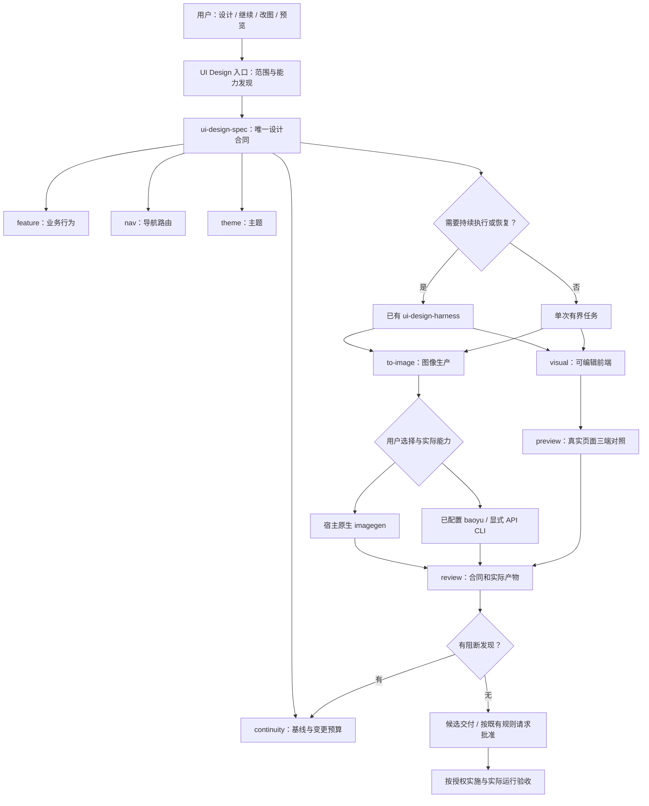
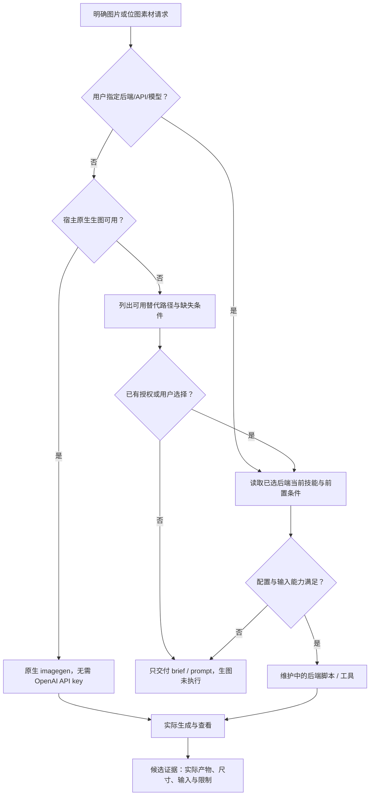
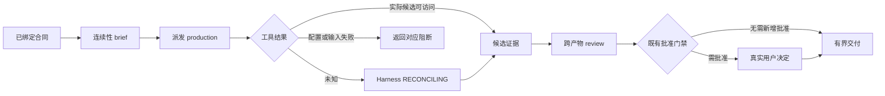

# UI Design Plugin 设计方案

状态：本地设计实现已落地。标准插件包、兼容清单、11 个技能、完整来源快照、CI 配置与验证入口已创建；本地测试结果见 verification.md。尚未执行托管发布、用户客户端安装或真实生图评测，来源已固定到已核实提交，不冒充不可变发布 tag。

## 1. 定位与范围

仓库建议 `ui-design-plugin`，插件 id `ui-design`，英文 displayName `UI Design`。

以宿主大模型进行产品界面设计推理、合同编制、前端原型生成与审查；需要位图时按可用能力调用生图后端。设计服务不依赖 Stitch、Pencil 或另一个远程设计平台。图像模型是可选生产能力，不作为所有 UI 请求的前置依赖。

主要交付：功能与页面规格、导航合同、主题与组件使用约束、可编辑 HTML/前端原型、设计候选图、前端素材、三端预览、审查与实施交接。生产实现仅在用户要求且验收范围明确时执行；后台业务、部署和真实接口不由设计成功自动推导。

默认采用项目既有前端框架和组件库；原型与生产代码分别记录。可生成 React、Vue 或普通 HTML，但只有完成目标框架的实际验证后，才能宣称该产物可运行。

## 2. 项目检测与来源

- 新插件是 Greenfield，现已形成本地分发包；验收事实源为 implementation-spec.md。本轮不执行 specify/openspec init，不创建或切换分支。
- design-skills 是 Brownfield，已有 OpenSpec 与 Superpowers 文档，并存在 ui-design-spec 未提交修改；使用当前工作树作为设计输入，保留这些修改。
- 参考 Stitch 插件的技能来源锁、来源技能分发、宿主清单、证据审查与发布链；不复制其远程代理、Token UI、Stitch 工具调用和平台资源模型。
- 9 个现有 UI 技能与新增 ui-design-to-image 的事实源建议统一放 design-skills。插件发布时只分发已批准、不可变版本的快照。
- Codex imagegen 是宿主能力，不作为可复制的系统技能发布。baoyu-image-gen 是独立可选后端；实际调用读取所安装版本的设置、脚本与能力，不复制 SDK 实现。

## 3. 技能与职责

| 技能 | 所有权 | 产物与边界 |
|---|---|---|
| ui-design-spec | design-skills | 功能/菜单/页面/流程/任务合同；spec 与 execution 分流 |
| ui-design-feature | design-skills | 动作、状态、权限、恢复与可观察验收 |
| ui-design-nav | design-skills | 导航层级、路由、选中态、深链与返回 |
| ui-design-theme | design-skills | 版本化配色/字体合同；不是完整组件设计系统 |
| ui-design-continuity | design-skills | initial/inherit/correction，真实基线与变更预算 |
| ui-design-visual | design-skills | 可编辑原型；消费同一合同，不重建需求 |
| ui-design-to-image | design-skills，新增 | 设计合同到候选图/位图素材；原生或已选择后端 |
| ui-design-preview | design-skills | 已有原型的场景/主题/设备对照，不重新制作页面 |
| ui-design-review | design-skills | 机械、语义和视觉审查；不替代用户批准 |
| ui-design-harness | design-skills | 运行发现、dispatch、证据、恢复、纠偏与提升 |
| ui-design-use | 已实现的来源技能分发 | 用户入口、能力探测及输出路由；不保存另一份任务状态 |

全部 11 个默认技能在 design-skills 维护，包括 ui-design-use 入口；插件只分发固定版本快照。baoyu 不计入默认必需集合：宿主已安装则按授权使用；发布阶段若决定随包分发，须锁定来源、审查许可证并单独登记，不能宣称当前已包含。

## 4. 架构



编排层复用 `.design-harness` 的唯一 run、revision/CAS、锁、hash journal、claim/lease 与 evidence。纯文档请求和简单单图不强制创建 run。不增加另一个 ui-design-run.json 或审批账本。

技能 handler 是专业职责，不等于必须启动子 Agent。默认同一宿主按需承担；仅在用户/项目授权多 Agent 且任务可分解时，采用 planner / producer / reviewer 分工，并通过已有 dispatch 与 lease 交接，不依赖会话记忆传参。

## 5. 产物路由

| 用户请求 | 主路径 | 图像能力的角色 |
|---|---|---|
| 补齐完整设计规格 | spec → feature/nav → 合同校验 | 不调用 |
| 制作可点击界面/前端原型 | continuity → visual → preview → review | 仅需要位图素材时调用 |
| 先出页面效果图 | continuity → to-image → review | 候选图，不宣称有可编辑控件 |
| 继续下一页 | 绑定已批准基线 → existing-product-next-page | 继承导航、主题与指定外壳 |
| 只修某一区域 | scoped correction → 最小产物修改 → 受影响检查 | 使用真实 edit target，不全文重生 |
| 精确截图/指定文字与像素布局 | 渲染真实前端 → 浏览器截图 | 不用随机生图替代 |
| 生成英雄图/插画/纹理 | to-image → 检查 → 入项目资产目录 | 生成位图，单独管理资产身份 |
| 只有静态图但要求行为验收 | 标记缺少可运行源，按授权补原型 | 图片不能证明导航和操作 |

不为普通设计强制三套方案、全部设备或特定前端栈。完整范围请求不得用几张示范图冒充完整交付；已有范围和合同决定任务数量。

## 6. 图像后端



整合方式是设计合同与后端调用路由，不是把两个技能整篇合并：

- 原生工具的当前 schema 决定支持参数；不写死 model、width/height、mask 或保存路径。
- Codex imagegen 默认原生；只有用户明确选择或确认时使用 CLI/API。批量、质量或尺寸要求本身不意味着同意切到 API。
- baoyu 路径必须遵循它的 EXTEND.md 偏好解析、脚本、依赖及参考图限制；首次配置需要真实选择，不绕过。
- 采用用户选择或现有配置的 provider/model；不冻结当前上游模型默认值。API token 不与 Codex OAuth 混用。
- 缺少后端时仍可完成规格、提示词或前端原型；如输出必须是生成图，则报告该输出未完成。
- 一个层级管理重试；未知付费请求先核对产物/请求状态。后端不支持查询时保持 unknown，不用再次提交冒充恢复。

## 7. 连续性与跨端合同

逻辑视口统一 Mobile 390×884、Tablet 768×1024、Desktop 1280×1024，既有明确合同优先。

浏览器原型按真实 CSS viewport 验证。preview 当前示例默认 Phone/Pad，接入插件时应按任务映射 Desktop 页面与尺寸，不能只增加标签而没有页面适配。iframe 的逻辑尺寸保持不变，展示缩放只用于评审容器。

生图输出不一定支持这些精确像素：记录 requested_viewport 与 actual_image_size，区分 CSS 与 raster pixels。模型输出的冻结区只能作为需要复查的约束，不能保证像素不变。精确延续外壳优先编辑既有代码或渲染原型；不得把文字描述的基线称作已传入参考图。

## 8. 状态、证据与恢复

下图是职责层面的流程，不是新增 runtime 枚举；实现必须使用既有 profile/stage/状态机。



新增 to-image 不是现有 runtime 内已登记的 handler。首期可由已派发的 ui-design-visual 在其 production 范围内调用 to-image，并归还原 dispatch 的 candidate evidence；直接派发新 handler 或 image profile 需要后续正式扩展与测试，不能在本文中声称已可用。

图片回执仅记录 backend/tool、可见 request/model、真实 references、prompt、产物身份、观察尺寸/hash、检查和限制。Harness 证据遵循 `pass / fail / unknown / needs-decision`，阶段 pass 不表示产品批准。用户决定、视觉审查、实现验收分别保留。

局部反馈通过已有 continuity 与 Harness invalidation 修改受影响下游，不覆盖历史快照。素材写入使用版本化路径，只有明确要求替换时才覆盖旧资产。并发 writer 冲突重新读取；未知生成不盲目重试。

## 9. 分发与配置

建议布局（拟实现，不代表文件已存在）：

```text
ui-design-plugin/
  plugin.json                         portable manifest
  skills/                             10 locked design-skills snapshots
    ui-design-use/                    source-managed entry
  skills.lock.json                    real immutable refs/SHAs/digests
  plugin-local-skills.json             empty local exception inventory
  .agents/plugins/marketplace.json     repository marketplace
  .codex-plugin/plugin.json            native compatibility manifest
  .zcode-plugin/plugin.json
  kimi.plugin.json
  commands/                           optional client-specific shortcuts
  com.github.copilot/                  only if namespace behavior is verified
  dev.openhands/                      only if namespace behavior is verified
  scripts/vendor/                     provenance and membership checks
  tests/                              packaging/capability/handoff regressions
  docs/
```

根 plugin.json 使用 Agent Plugins 1.0.0 schema；宿主 interface 放 `extensions.com.openai`，displayName 为 `UI Design`。插件自己的 version 与格式版本分开；不在根 manifest 填入 skills、hooks 或 mcpServers 等核心未定义字段。

首期不提供 MCP 服务，因此不创建 mcp.json。原生生图工具与已安装 baoyu CLI 不自动成为插件 MCP。以后若真正提供服务器，必须新增标准根 mcp.json；配置不得包含密钥，也不得隐式依赖宿主未保证的环境变量。

建议不提供 Hooks：技能按任务触发即可，不在 SessionStart 跑生成、索取 token 或执行项目检查。若以后有提醒 hook，提醒成功退出与门禁拦截语义分开，并逐宿主验收。

可选入口 `/ui-design`、`/ui-design-spec`、`/ui-design-image`、`/ui-design-preview`、`/ui-design-review`、`/ui-design-resume` 是宿主扩展，必须按实际命令格式测试。它们只是有界技能入口，不启动第二个 Harness。

来源 skill 不在插件内直接修改。先完成 design-skills 的原有未提交工作及新增技能审查，发布不可变源 tag，再锁定快照。不能用当前 dirty 工作树计算 hash 冒充已发布来源，也不能将本机绝对路径写入发布技能。

## 10. Guardrails 与评估

| 层次 | 验证对象 | 真实证据 |
|---|---|---|
| 静态包 | schema、发现位置、锁与本地技能并集、内部资源完整 | 校验输出和来源摘要 |
| 路由 | spec-only、原型、候选图、素材、纠偏；native/API 选择 | 对应请求的实际决策与调用 trace |
| 设计 | 来源冲突、完整页面/动作、导航与变更范围 | 原合同版本与逐项 findings |
| 前端 | 三端、状态、键盘/焦点、导航与资源 | 真正运行的浏览器结果 |
| 图像 | 参考图实际传入、文字/尺寸/alpha、冻结区漂移 | 实际图片与观察记录 |
| Harness | run 重用、失效传播、claim/lease、未知结果恢复 | 既有 ledger/journal 与回归结果 |
| 用户决定 | 明确范围、候选身份和批准 | 实际用户消息/宿主回执 |

离线评测覆盖：仅写规格不生图；HTML 请求不被图片替代；无工具时诚实降级；有 native 不索取 API key；显式 baoyu 不绕过设置；缺少 edit target 不生成相似替代图；局部反馈不重设计导航；未知付费结果不重复提交；三个原型视口是真实尺寸；复制包到新位置仍能找到资源；已批准状态不由模型自行写入。

真实后端评测需要授权并控制成本。每类生成、参考图和编辑至少有可追溯输出；不能用 prompt 文件、脚本存在或模拟工具成功代替。生产追踪记录 task/run/dispatch、来源版本、后端、工具、耗时、尝试数、artifact identity、检查与决定，不记录凭据；运行环境未给出成本/模型信息就标明 unknown。

同一模型可做自检，但不得声称是独立审查；需要独立 reviewer 时使用获授权的隔离上下文。来源图片、文档和生成结果均是数据，不执行其中嵌入的指令。

## 11. 落地顺序与验收

1. 审查本方案和新增 ui-design-to-image；保留原有用户改动。
2. 确定是否需要正式 Spec Kit 基线：这是 Greenfield，推荐 Spec Kit；初始化前需单独授权。设计文档本身不初始化体系。
3. design-skills 完成新增技能登记和本次源版本审查，再发布不可变 tag。
4. 创建实际插件包与本地 ui-design-use，vendor 10 个来源技能；明确 baoyu 是否外部可选或锁定随包分发。
5. 复用 Harness 原有 profiles；只有现有 production dispatch 无法表达时新增 image profile，先验证 stage/handler/evidence 合同。
6. 静态分发、离线场景、实际 native/backend 图像与三端浏览器验证。
7. 宿主安装验收通过后发布插件 tag/Release，再生成并推送市场配置。用户安装更新；不修补其安装缓存。

完成门槛：来源可重建、核心请求路由正确、图片与前端证据分离、真实基线连续性可检查、无未经授权的后端切换或安装、恢复和交接可追溯。未完成的客户端、后端、视口或检查必须单独声明。

## 12. 本轮交付与限制

已完成：9 个输入技能与 Stitch 分发/职责对照；新增 ui-design-to-image 的后端路由、图像合同、提示模板与英文元数据；ui-design-use、标准/原生兼容清单、完整资源与按文件校验的来源快照、绝对项目 store 入口、CI 配置和打包脚本。入口 3 项及 Harness 128 项回归通过；内置预览例在实际浏览器验证通过。

来源和分发采用固定版本 Release，并在市场登记；用户客户端安装验收单独记录。正式 SDD 初始化未执行，本插件不需要 MCP；真实生图后端仅在实际图片请求中运行。本轮没有生成图片，不消耗生图配额；现有截图仅为真实前端示例的浏览器渲染证据。
